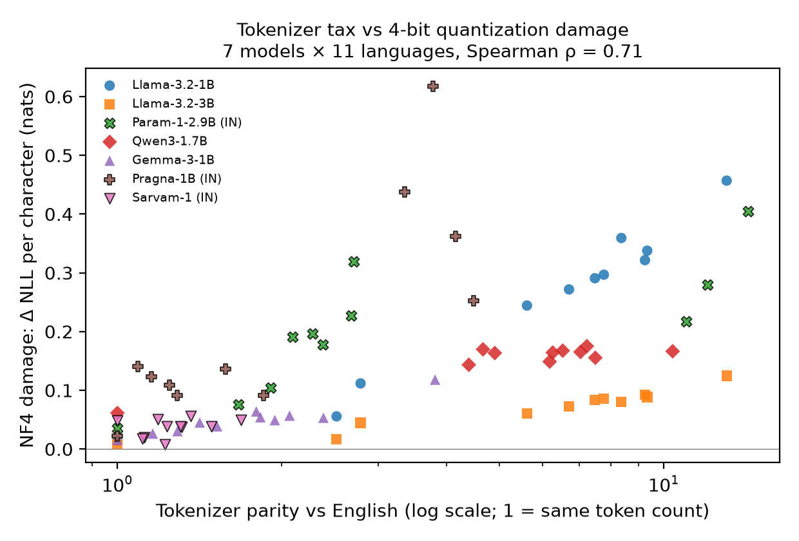

# Taxed Twice: Tokenizer Parity Predicts 4-bit Quantization Damage in Indic Language Models

Shrey Sati · JSS University, Noida

Small language models usually run quantized on laptops, phones and edge devices. This repository tests whether 4-bit quantization hurts Indian languages evenly, using 7 open models (1–3B parameters) and 11 languages (English + 10 Indian languages) on 256 parallel sentences from AI4Bharat's IN22-Gen.

**Main result.** A language's *tokenizer parity* (its token count relative to the same content in English) predicts how much its per-character negative log-likelihood degrades under NF4 quantization: Spearman ρ = 0.71 over 77 model–language pairs (p < 10⁻⁴, within-model permutation test). The correlation is ρ = 0.65 after subtracting each model's own English damage.



- Paper: [`paper/paper.pdf`](paper/paper.pdf)
- Interactive tokenizer comparison (22 languages, 13 tokenizers): https://huggingface.co/spaces/satanrayshe/indic-tokenizer-tax
- Full record of every run, change and corrected error: [`experiments/02_quantization/AUDIT_LOG.md`](experiments/02_quantization/AUDIT_LOG.md)

## Models
| Model | Type | Precisions |
|---|---|---|
| Llama-3.2-1B, Llama-3.2-3B | global | bf16 / int8 / NF4 |
| Gemma-3-1B-pt | global | bf16 / int8 / NF4 |
| Qwen3-1.7B-Base | global | bf16 / int8 / NF4 |
| Sarvam-1 | Indic-built | bf16 / int8 / NF4 |
| Pragna-1B | Indic-built | bf16 / int8 / NF4 |
| PARAM-1-2.9B-Instruct | Indic-built | bf16 / NF4 (see audit log) |

Exact Hugging Face revisions are in `experiments/02_quantization/env/environment.txt`.

## Repository layout
```
paper/                      LaTeX source, bibliography, compiled PDF
  analysis.py               produces every number, table and figure in the paper -> stats.json, tables.tex, figures/
experiments/01_tokenizer_tax/
  tokenizer_tax.py          tokenizer parity for 13 tokenizers x 22 languages -> results.csv, heatmap
experiments/02_quantization/
  quant_tax.py              NLL/char at bf16, int8, NF4 -> results_<model>.csv, per_sentence_<model>.csv
  bootstrap.py              paired bootstrap 95% CIs -> ci_<model>.csv
  translate_eval.py         few-shot translation, both directions, chrF++ -> mt_*.csv
  parity256_vs_damage.csv   parity and NF4 damage on the same 256 sentences (input to analysis.py)
  AUDIT_LOG.md              method as run, run table, verified claims, mistakes and fixes, limitations
  env/                      exact package versions, model/dataset revisions, verified citations
```

## Reproducing
Hardware used: one RTX 5060 Laptop GPU (8 GB), 16 GB RAM, Windows 11.

1. **Access.** Accept the terms on Hugging Face for `ai4bharat/IN22-Gen` (gated), `meta-llama/Llama-3.2-1B`, `meta-llama/Llama-3.2-3B` and `google/gemma-3-1b-pt`, then log in with `hf auth login`.
2. **Environment.** Python 3.12, PyTorch with CUDA 12.8 (`pip install torch --index-url https://download.pytorch.org/whl/cu128`), then the packages in `experiments/02_quantization/env/main_venv_freeze.txt`.
   PARAM-1 needs a separate environment with `transformers==4.46.3` (`env/legacy_venv_freeze.txt`). Its remote code does not run correctly on transformers 5 (see audit log, M4).
3. **Run**, for example:
   ```
   python experiments/02_quantization/quant_tax.py --model sarvamai/sarvam-1 --n 256
   python experiments/02_quantization/bootstrap.py experiments/02_quantization/per_sentence_sarvam-1.csv
   python experiments/02_quantization/translate_eval.py --model google/gemma-3-1b-pt --n 64 --direction en2x
   python paper/analysis.py
   ```
   Lower `--token-budget` if a model runs out of GPU memory. It changes batching only, never the scores beyond bf16 rounding.
4. **Paper.** Put `acl.sty` and `acl_natbib.bst` from https://github.com/acl-org/acl-style-files in `paper/`, then run `pdflatex`, `bibtex`, `pdflatex`, `pdflatex`.

The translation CSVs contain model outputs but not the IN22-Gen reference sentences. Get those from the gated dataset.

## Limitations
The main metric is teacher-forced likelihood, and translation results only partly follow it. Other limitations: all models are 1–3B; there is one quantization family (bitsandbytes); parity and training-data share are confounded (Pragna-1B is the only disentangling case); the data is one general-domain dataset. The full list is in the paper and the audit log.

## Licence
- Code: MIT (`LICENSE`).
- Results and derived data: CC BY 4.0 (`LICENSE-DATA`). They are derived from IN22-Gen (AI4Bharat, CC BY 4.0).

## Citation
```bibtex
@misc{sati2026taxedtwice,
  title  = {Taxed Twice: Tokenizer Parity Predicts 4-bit Quantization Damage in Indic Language Models},
  author = {Sati, Shrey},
  year   = {2026},
  note   = {https://github.com/satanrayshe/taxed-twice}
}
```
